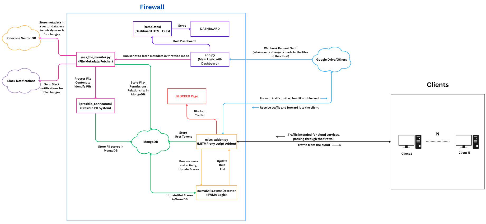

# Juniper SaaS API Monitoring

## Table of Contents
1. [Project Overview](#project-overview)
2. [Architecture](#architecture)
3. [Repository Layout](#repository-layout)
4. [Environment & Configuration](#environment--configuration)
5. [Setup & Quick Start](#setup--quick-start)
   - [1. Google Cloud Console Configuration](#1-google-cloud-console-configuration)
     - [1.1 Create a Google Cloud Project](#11-create-a-google-cloud-project)
     - [1.2 Enable Required APIs](#12-enable-required-apis)
     - [1.3 Configure OAuth Consent Screen](#13-configure-oauth-consent-screen)
     - [1.4 Create OAuth 2.0 Credentials](#14-create-oauth-20-credentials)
   - [2. MongoDB Configuration](#2-mongodb-configuration)
     - [2.1 Navigate to the Data Explorer](#21-navigate-to-the-data-explorer)
     - [2.2 Create Your Database (EWMAconfig)](#22-create-your-database-ewmaconfig)
     - [2.3 Add More Collections to EWMAconfig](#23-add-more-collections-to-ewmaconfig)
     - [2.4 Repeat for All Other Databases](#24-repeat-for-all-other-databases)
   - [3. Dropbox Configuration](#3-dropbox-configuration)
   - [4. Pinecone Configuration](#4-pinecone-configuration)
   - [5. Slack & Jira Configuration](#5-slack--jira-configuration)
     - [5.1 Create a Slack App and Bot Token](#51-create-a-slack-app-and-bot-token)
     - [5.2 Environment Variables](#52-environment-variables)
     - [5.3 Sending a Test Message](#53-sending-a-test-message-python-snippet)
     - [5.4 Uploading Files and Charts to Slack](#54-uploading-files-and-charts-to-slack)
     - [5.5 Slack Error Handling & Retries](#55-slack-error-handling--retries)
     - [5.6 Notes on Permissions & Security](#56-notes-on-permissions--security)
   - [6. Jira Integration Setup](#6-jira-integration-setup)
     - [6.1 Prerequisites](#61-prerequisites)
     - [6.2 Create an Atlassian API Token](#62-create-an-atlassian-api-token)
     - [6.3 Install Python Client](#63-install-python-client)
     - [6.4 Test Jira Connectivity](#64-test-jira-connectivity-python-snippet)
     - [6.5 Create an Issue Programmatically](#65-create-an-issue-programmatically)
     - [6.6 Issue Fields, Priority Mapping & Remediation Links](#66-issue-fields-priority-mapping--remediation-links)
     - [6.7 Chart Generation & Slack Upload Flow](#67-chart-generation--slack-upload-flow)
     - [6.8 Idempotency & Deduplication](#68-idempotency--deduplication)
     - [6.9 Security & Least Privilege](#69-security--least-privilege)
6. [Setup](#setup)
   - [1. Virtual Environment](#1-virtual-environment)
   - [2. MongoDB](#2-mongodb)
   - [3. TLS / mitmproxy Certificates](#3-tls--mitmproxy-certificates)
   - [4. Ngrok Installation](#4-ngrok-installation)
   - [5. Setting Up the Dashboard](#5-setting-up-the-dashboard)
   - [6. Running MITM Proxy](#6-running-mitm-proxy)

---

## Project Overview


This project implements a comprehensive file monitoring and security system that tracks activity across Google Drive and Dropbox cloud storage platforms. The system captures user interactions, file permissions, and sharing patterns in real-time through a combination of Google Drive APIs, Dropbox APIs, and network traffic interception using mitmproxy. 

The system automatically detects suspicious activities such as excessive file sharing, unauthorized access attempts, file deletions, and file downloads, then implements statistical blocking mechanisms to prevent potential data breaches. It stores all activity data in MongoDB for analysis, provides a web dashboard for monitoring file access patterns and user permissions, uses statistical techniques (EWMA - Exponentially Weighted Moving Average) to track user behavior patterns, and can automatically block users who exceed sharing thresholds or attempt unauthorized actions.

Additionally, the system includes specialized sensitivity analysis using Microsoft Presidio to identify files containing personally identifiable information (PII) or other sensitive data.

---

## Architecture



---

## Repository Layout

```
webhooks/
├── .git/
├── all-MiniLM-L6-v2/
├── certs/
├── fake_data/
├── readme_assets/
│   ├── architecture.pdf
│   └── architecture.png
├── templates/
│   ├── blocked_users.html
│   ├── file_based.html
│   ├── index.html
│   ├── sensitive_files.html
│   ├── token_mappings.html
│   └── user_based.html
├── venv/
├── .env
├── .gitignore
├── app.py
├── ewmaDetector.py
├── ewmaUtils.py
├── mitm_addon.py
├── permissionCounter.py
├── pres_airtableSensitivityUpdate.py
├── pres_drive_scan_airtable.py
├── pres_helper_constants.py
├── pres_presidio_connector.py
├── pres_presidio_scanner.py
├── README.md
├── requirements.txt
└── saas_file_monitor.py
```

---

## Environment & Configuration

Create a `.env` file in the repository root with the following variables:

```bash
WEBHOOK_URL=ngrok_url_here/webhooks/drive

GOOGLE_CLIENT_ID=google_client_id
GOOGLE_CLIENT_SECRET=google_client_secret
GOOGLE_DRIVE_FOLDER_ID="NULL"  # Set to "NULL" to monitor the entire drive

MONGODB_URI=mongo_connection_uri

DROPBOX_ACCESS_TOKEN=dropbox_token

PINECONE_API_KEY=pinecone_key

SLACK_TOKEN=slack_token

AIRTABLE_TOKEN=airtable_token
AIRTABLE_BASE_ID=airtable_base_id

SAAS_MONITOR_THROTTLE_SECONDS=60
PRESIDIO_SCANNER_THROTTLE_SECONDS=60
PRESIDIO_DELAY_SECONDS=120
```

## Setup & Quick Start

### 1. Google Cloud Console Configuration

**For Admin Account**

Follow these steps to set up Google Cloud Console credentials for the file monitoring system:

#### 1.1 Create a Google Cloud Project

1. Go to the [Google Cloud Console](https://console.cloud.google.com/)
2. Click on the project dropdown at the top of the page
3. Click **"New Project"**
4. Enter a project name (e.g., "File-Monitor-System")
5. Click **"Create"**
6. Wait for the project to be created and ensure it's selected

#### 1.2 Enable Required APIs

1. In the Google Cloud Console, navigate to **"APIs & Services" > "Library"**
2. Search for and enable the following APIs:
   - **Google Drive API** - Click "Enable"
   - **Google Drive Activity API** - Click "Enable"
3. Wait for the APIs to be enabled

#### 1.3 Configure OAuth Consent Screen

1. Navigate to **"APIs & Services" > "OAuth consent screen"**
2. Choose **"Get Started"**
3. Fill in the required fields:
   - **App name**: Enter your application name (e.g., "File Monitor System")
   - **User support email**: Enter your email address, click Next
   - **Select External**: Select External users option, click Next
   - **Developer contact information**: Enter your email address, click Next and Agree
4. Click **"Save and Continue"**
5. On the "Data Access" page, click **"Add or Remove Scopes"**
6. Add the following scopes:
   - `https://www.googleapis.com/auth/userinfo.email`
   - `https://www.googleapis.com/auth/userinfo.profile`
   - `https://www.googleapis.com/auth/drive.file`
   - `openid`
   - `https://www.googleapis.com/auth/drive.readonly`
   - `https://www.googleapis.com/auth/drive.meet.readonly`
   - `https://www.googleapis.com/auth/drive`
   - `https://www.googleapis.com/auth/drive.metadata`
   - `https://www.googleapis.com/auth/drive.metadata.readonly`
7. Click **"Update"** and then **"Save and Continue"**
8. On the "Audience" page, add your email address as a test user (and other users/employees of the organization)
9. Click **"Save and Continue"**
10. Review the summary and click **"Back to Dashboard"**

#### 1.4 Create OAuth 2.0 Credentials

1. Navigate to **"APIs & Services" > "Credentials"**
2. Click **"+ Create Credentials"** and select **"OAuth client ID"**
3. Choose **"Web application"** as the application type
4. Enter a name for your OAuth client (e.g., "File Monitor Desktop Client")
5. Under Authorized JavaScript origins:
   - Add the Firewall URL (for testing use: http://localhost:5001/)
   - Add Ngrok URL (see Ngrok Configuration Section)
6. Under Authorized redirect URIs:
   - Add the Firewall URL (for testing use: http://localhost:5001/)
   - Add http://localhost:5001/auth/google/callback or http://[FIREWALL_URL]/auth/google/callback
7. Click **"Create"**
8. A dialog will appear with your client ID and secret - click **"Download JSON"**
9. Save the file as `credentials.json` in your project's root directory (same folder as `app.py`)
10. **Important**: Keep this file secure and never commit it to version control

### 2. MongoDB Configuration

#### 2.1 Navigate to the Data Explorer

First, log in to your MongoDB Atlas account.
1. On the main screen for your project, select your **Cluster**
2. In the main panel, click the **"Browse Collections"** button (this may also be called **"Data Explorer"** in the left-hand menu)

#### 2.2 Create Your Database (EWMAconfig)

In MongoDB, you create a database by creating its first collection.

1. In the Data Explorer, click the **"Create Database"** button
2. A pop-up window will appear. Fill in the two fields:
   - Database Name: `EWMAconfig`
   - Collection Name: `usersBool`
3. Click **"Create"**

You will now see `EWMAconfig` in the database list on the left.

#### 2.3 Add More Collections to `EWMAconfig`

Now you'll add the remaining collections to the `EWMAconfig` database.

1. Hover over the `EWMAconfig` database name in the left-hand sidebar
2. Click the **plus icon `(+)`** that appears next to the name
3. A new "Create Collection" window will appear
   - Collection Name: `usersConfig`
4. Click **"Create"**
5. **Repeat this process** for the last collection in this database:
   - Collection Name: `usersInit`

#### 2.4 Repeat for All Other Databases

Follow the same two-part process for the rest of your databases.

**For `FileInfo`**
1. Click **"Create Database"** (the button at the top of the list)
2. Database Name: `FileInfo`
3. Collection Name: `FileActivityLogs`
4. Click **"Create"**
5. Click the **`+` icon** next to `FileInfo` and add: `FileActivityLogs`
6. Click the **`+` icon** next to `FileInfo` again and add: `fileCount`

**For `JuniperAnalytics`**
1. Click **"Create Database"**
2. Database Name: `JuniperAnalytics`
3. Collection Name: `EWMAParameters`
4. Click **"Create"**
5. Click the **`+` icon** next to `JuniperAnalytics` and add: `RealTimeEvents`
6. Click the **`+` icon** next to `JuniperAnalytics` again and add: `UserAnalytics`

**For `MitmProxyLogs`**
1. Click **"Create Database"**
2. Database Name: `MitmProxyLogs`
3. Collection Name: `HistoricalData`
4. Click **"Create"** (this database only has one collection)

**For `UserTokenMapping`**
1. Click **"Create Database"**
2. Database Name: `UserTokenMapping`
3. Collection Name: `TokenUser`
4. Click **"Create"**
5. Click the **`+` icon** next to `UserTokenMapping` and add: `UserCookies`
6. Click the **`+` icon** next to `UserTokenMapping` again and add: `UserIdMaps`

### 3. Dropbox Configuration

#### 3.1 Create Dropbox App & Scopes
1. Go to https://www.dropbox.com/developers/apps → Create App
2. Choose **Scoped access** → App folder or Full Dropbox
3. Under **Permissions**, ensure:
   - `files.metadata.read`
   - `files.content.read` (if you will read file contents)
4. Generate access token (or use OAuth flow)

### 4. Pinecone Configuration
1. Sign up at https://www.pinecone.io/
2. Create a project and generate an API key
3. Add the API key to `.env`
4. Note the environment/region (e.g., `us-east-1`)

### 5. Slack & Jira Configuration

**Purpose**: Send real-time alerts and charts to a Slack channel when the monitoring system detects suspicious file activity, PII, or policy violations. Also used to deliver Jira summary charts and follow-up messages.

#### 5.1 Create a Slack App and Bot Token
1. Visit Slack API: https://api.slack.com/apps → **Create New App** → From scratch
2. Name the app (e.g., `JuniperSecurityBot`) and select your workspace
3. Under **OAuth & Permissions** → **Bot Token Scopes**, add these scopes as a minimum:
   - `chat:write` (post messages)
   - `files:write` (upload files/charts)
   - `channels:read` (discover public channel IDs)
   - `groups:read` (discover private channel IDs if needed)
   - `users:read` (optional, to map user IDs to emails)
4. Install the app to your workspace and **copy the Bot User OAuth Token** (starts with `xoxb-...`). **Do not commit this token**. Store it in `.env` as `SLACK_BOT_TOKEN`
5. Add the bot to the channel you want to post into (invite the bot to channel in Slack UI): `/invite @JuniperSecurityBot`

#### 5.2 Environment Variables
Add to `.env`:
```ini
SLACK_TOKEN=xoxb-...
```

**How to get `SLACK_CHANNEL_ID`**: Right-click channel → View channel details → More → Copy channel ID, or open the channel in browser and read the `C...` ID from the address bar.

#### 5.3 Sending a Test Message (Python snippet)

```python
import os
from slack_sdk import WebClient
client = WebClient(token=os.getenv("SLACK_BOT_TOKEN"))
client.chat_postMessage(channel=os.getenv("SLACK_CHANNEL_ID"), text="✅ JuniperSecurityBot connected")
```

Run it in your environment and confirm the message appears in Slack.

#### 5.4 Uploading Files and Charts to Slack
Use `files_upload` (or `files_upload_v2`) to attach charts:

```python
with open("jira_issue_summary.png", "rb") as f:
    client.files_upload_v2(file=f, channel=os.getenv("SLACK_CHANNEL_ID"), title="Jira Summary")
```

Check logs for upload success; ensure the bot has `files:write` scope.

#### 5.5 Slack Error Handling & Retries
- Catch `slack_sdk.errors.SlackApiError` and log `e.response["error"]`
- Implement exponential backoff for repeated 429 rate-limit responses
- For persistent failures, write alert to local syslog file for manual review

#### 5.6 Notes on Permissions & Security
- Only give the bot the minimum scopes needed
- Prefer channel-scoped posting (invite bot to channels) instead of global workspace posting
- Rotate the Bot token and use environment secrets management (AWS Secrets Manager/Vault) for production

### 6. Jira Integration Setup

**Purpose**: Create Jira tickets automatically for incidents, keep track of triage/response, and generate status charts uploaded to Slack.

#### 6.1 Prerequisites
- Jira Cloud account with permission to create API tokens and write issues in the target project
- Know your Jira domain (e.g., `https://your-domain.atlassian.net`) and `JIRA_PROJECT_KEY` (e.g., `SEC`)

#### 6.2 Create an Atlassian API Token
1. Visit: https://id.atlassian.com/manage/api-tokens
2. Click **Create API token** → name it `JuniperMonitor` → **Create** → **Copy** token
3. Store token in `.env` as `JIRA_API_TOKEN` and set `JIRA_EMAIL` (the account used to create the token)

#### 6.3 Install Python Client
```bash
pip install jira
```

#### 6.4 Test Jira Connectivity (Python snippet)

```python
import os
from jira import JIRA

jira = JIRA(server=os.getenv("JIRA_DOMAIN"), basic_auth=(os.getenv("JIRA_EMAIL"), os.getenv("JIRA_API_TOKEN")))
projects = jira.projects()
print([p.key for p in projects])
```

If you can list projects, authentication works.

#### 6.5 Create an Issue Programmatically

```python
issue_dict = {
    "project": {"key": os.getenv("JIRA_PROJECT_KEY")},
    "summary": "Unauthorized File Access Detected: finance.xlsx",
    "description": "Detected unauthorized share/permission change: details... see logs",
    "issuetype": {"name": "Task"},
    "labels": ["juniper", "security"],
}
new_issue = jira.create_issue(fields=issue_dict)
print("Created:", new_issue.key)
```

#### 6.6 Issue Fields, Priority Mapping & Remediation Links
- Map severity from detection pipeline to Jira `priority` (e.g., High/Medium/Low)
- Include direct links in the `description` to the `mitmdump` logs, Pinecone metadata, or file IDs for faster investigation
- Use Jira labels for filtering (`juniper`, `drive-monitor`, `pii`, etc.)

#### 6.7 Chart Generation & Slack Upload Flow
1. Periodically call Jira to fetch issue counts by status (To Do/In Progress/Done)
2. Generate a PNG (matplotlib) and upload to Slack via `files_upload_v2`
3. Example chart upload uses the Slack snippet in section 5.4

#### 6.8 Idempotency & Deduplication
- Maintain a local alert store (JSON file or Mongo collection) to avoid duplicate Jira tickets for the same event
- Use a deterministic event key (e.g., `sha256(user_email + file_id + event_type + window_start)`) to dedupe events within a time window

#### 6.9 Security & Least Privilege
- Use a dedicated Jira service account with only needed permissions (create issues, view project)
- Store `JIRA_API_TOKEN` securely and rotate it periodically
- Restrict the Jira service account to the project(s) it needs

---

## Setup

### 1. Virtual Environment

```bash
python3 -m venv venv
source venv/bin/activate      # Windows: .\venv\Scripts\activate
pip install -r requirements.txt
```

### 2. MongoDB

- Create a MongoDB Atlas cluster (or run locally)
- Whitelist your development IP if using Atlas
- Set `MONGO_URI` in `.env`
- Verify connection

### 3. TLS / mitmproxy Certificates

- Download mitmproxy from https://mitmproxy.org/
- Refer to the documentation at https://docs.mitmproxy.org/stable/concepts/certificates/ for instructions on adding certificates to the system
- #### Firewall
    - Visit mitm.it after running the mitm proxy script as explained below.
    - Download the `certificates` and store them in the `certs/` folder in the root directory.
    - Copy the certificate to install on the client side.
- #### Client Side
    - Add the certificate(s) obtained from the firewall in the client browser or OS.

### 4. Ngrok Installation

- Download ngrok from https://ngrok.com/download
- **In a separate terminal**, run the following command to expose port 5001 for webhook configuration:

```bash
ngrok http 5001
```
- Copy the generated URL and paste it into `.env` as the `WEBHOOK_URL` value

### 5. Setting Up the Dashboard

Run the `pres_presidio_connector.py` to generate fake data for Presidio Addon:
```bash
python pres_presidio_connector.py
```

Then run the `saas_file_monitor.py` once to populate the database with file metadata initially:
```bash
python saas_file_monitor.py
```

Run the script for dashboard `app.py`:
```bash
python app.py
```

### 6. Running MITM Proxy

```bash
mitmdump -s mitm_addon.py --listen-port 8080 --set confdir=./certs
```

The dashboard can be viewed at:
```bash
https://localhost:5001/
```
or the Ngrok URL.